Predict a Home's Current Market Value
================
true
April 12, 2019


-   [Abstract](#abstract)
-   [Exploratory Data Analysis](#exploratory-data-analysis)
    -   [Missing Value](#missing-value)
    -   [Outcome](#outcome)
-   [Prediction](#prediction)
    -   [Imputation of Missing data in Testing Set](#imputation-of-missing-data-in-testing-set)
    -   [Models](#models)

``` r
library(readr)
library(dplyr)
library(lubridate)
library(ggplot2)
library(tidyr)
library(stringr)
library(corrplot)
library(leaflet)
library(htmlwidgets)
library(xtable)
library(data.table)
library(DT)
library(MASS)
library(pander)
library(kableExtra)
library(glmnet)
```

Abstract
========

The goal of the project is to predict a home's current market value. Before we built our own model, we started from exporatory data analysis based on the training set. The data analysis gave us intuitions of how houses' features correlated with each other as well as market price. The information helped us to do missing imputation and further prediction. Making a clear interpretation and displaying how features contribute to the outcome matter in the marketing. Therefore, a linear model is used as a baseline reference. However, considering of relatively large number of features, and the issue of overfitting, we further proposed LASSO to predict a home's current market value. It showed us that LASSO worked much better than linear regression in training set, and also its prediction preformed a similar pattern in the testing set as comparing with the training set.

Exploratory Data Analysis
=========================

Before predicting the home's price, we do data analysis of the training set. The reason to do so is to have a brief understanding of the data, including the statistics of features, the missing of the data, and any potential results which will help us to do final prediction.

In the trianing set, there are 11588 properties, and 24 features (including the price). For the testing, there are 4402 properties. Have peak of the training set.

Notice that *censusblockgroup* and *Usecode* are only one value. Therefore, we won't consisder them as our predictors.


Missing Value
-------------

We check the missing from our training set @ref(fig:missingTrain). We can see that there is missing among *BuiltYear*,*View Type*, *Number of Bedroom*, *Finished Sqaure Feet*, *Garage Square Feet*, *Number of Story*, *BGMedHomeValue*, *BGMedRent*, and *BGMedYearBuilt* in trainging set.

### Dealing with missing

Due the purpose of the project, we need to impute the missing.

-   *View Type*. The reason for large missing in *View Type* is because the data set treats no view as missing. Therefore, we assign 0 to missing View Type.
-   *Garage Square Feet*. There are 2841 (24.52%) missing. The range (without missing) in training set is from 10 to 7504. We will assign 0 to missing value, since NA can mean there is no garage in the property.
-   *Number of Bedroom*, *Number of Story*. We treat them as ordinal variable. Ordinal logistic regression can be used to impute the missing. Details are showen in the following.
-   *BuiltYear*, *Finished Sqaure Feet*, *BuiltYear*, *BGMedHomeValue*, *BGMedRent*, and *BGMedYearBuilt*. They are continuous variable. We will use linear regression to impute the missing.

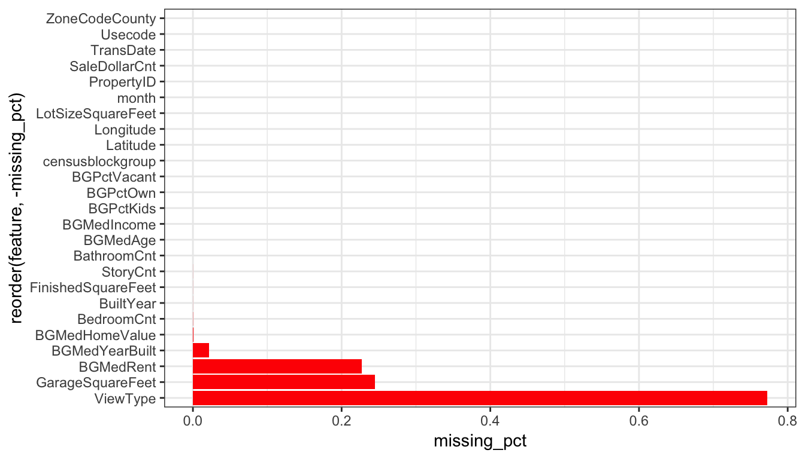

#### Correlation

Before we start the imputation, we first look at the correlation plot Fig. @ref(fig:corr). In order to keep the robustness of the model, we only use most relevant variables (correlation coefficient &gt; 0.4 or &lt; -0.4) as predictors to impute the missing. For example, *BathroomCnt, FinishedSquareFeet, StoryCnt, BuiltYear* are most correlated with *BedroomCnt*

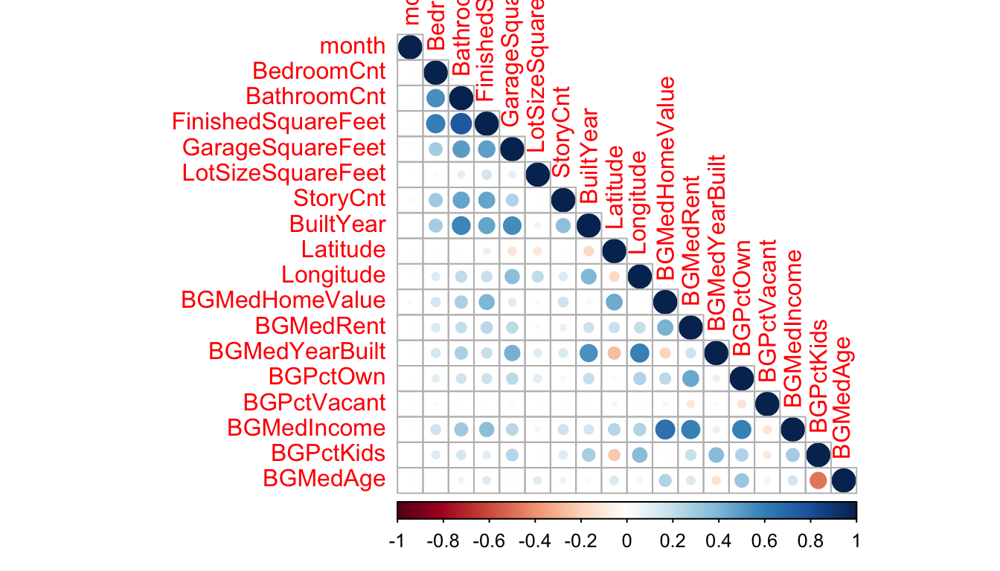

#### Imputation of the Number of Story and Number of Bedroom

In the training set, the number of story ranges from 1 to 3. There is only one missing of story information, Tab. @ref(tab:tableStory). We assume the number of stories distributed with multinomial distribution. Based on the counts, we have the empirical distributions.

<table class="table" style="margin-left: auto; margin-right: auto;">
<caption>
distribution of number of bedroom
</caption>
<thead>
<tr>
<th style="text-align:right;">
StoryCnt
</th>
<th style="text-align:right;">
n
</th>
</tr>
</thead>
<tbody>
<tr>
<td style="text-align:right;">
1
</td>
<td style="text-align:right;">
4429
</td>
</tr>
<tr>
<td style="text-align:right;">
2
</td>
<td style="text-align:right;">
4170
</td>
</tr>
<tr>
<td style="text-align:right;">
3
</td>
<td style="text-align:right;">
111
</td>
</tr>
</tbody>
</table>
In the training set, the number of bedrooms ranges from 1 to 9 Tab. @ref(tab:tableBedroom). The number of missing is three. We use ordinal logistic regression to impute the missing
<table class="table" style="margin-left: auto; margin-right: auto;">
<caption>
distribution of number of bedroom
</caption>
<thead>
<tr>
<th style="text-align:right;">
BedroomCnt
</th>
<th style="text-align:right;">
n
</th>
</tr>
</thead>
<tbody>
<tr>
<td style="text-align:right;">
1
</td>
<td style="text-align:right;">
103
</td>
</tr>
<tr>
<td style="text-align:right;">
2
</td>
<td style="text-align:right;">
1102
</td>
</tr>
<tr>
<td style="text-align:right;">
3
</td>
<td style="text-align:right;">
5107
</td>
</tr>
<tr>
<td style="text-align:right;">
4
</td>
<td style="text-align:right;">
4177
</td>
</tr>
<tr>
<td style="text-align:right;">
5
</td>
<td style="text-align:right;">
959
</td>
</tr>
<tr>
<td style="text-align:right;">
6
</td>
<td style="text-align:right;">
114
</td>
</tr>
<tr>
<td style="text-align:right;">
7
</td>
<td style="text-align:right;">
15
</td>
</tr>
<tr>
<td style="text-align:right;">
8
</td>
<td style="text-align:right;">
3
</td>
</tr>
<tr>
<td style="text-align:right;">
9
</td>
<td style="text-align:right;">
5
</td>
</tr>
<tr>
<td style="text-align:right;">
NA
</td>
<td style="text-align:right;">
3
</td>
</tr>
</tbody>
</table>
#### Imputation of the Continuous Variables

For continuous variables, we have *BuiltYear*, *FinishedSqaureFeet*, *BGMedHomeValue*, *BGMedRent*, and *BGMedYearBuilt*. Again, we find the most relevant variables which correlate with our missing variable. Linear regressions will be used. For example, we want to impute the missing of *FinishedSqaureFeet*. First, we find the subset which does not include any missing in our training. Then we fit a linear model using *FinishedSqaureFeet* as outcome, and its relevent variables as predictors. Finally, we can predict the missing for *FinishedSqaureFeet* in our training set. Further, the same linear model will be used in the testing set to fill the missing. Note that the prediction of missing in *BGMedYearBuilt* will be rounded and belonging to the range of un-missing BGMedYearBuilt.

Outcome
-------

First, we have a look at the outcome, price of current sale. The distribution is shown as below. 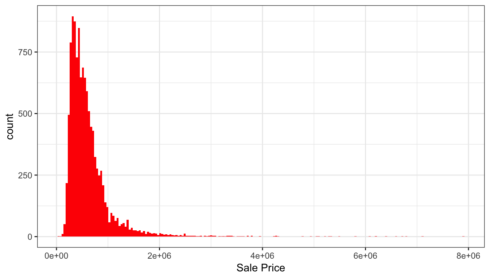 \#\#\# How Price Varies with Transaction Dates The range of transaction dates is from 04/01/2015 to 09/30/2015. We further show the distribution of transaction dates Fig. @ref(fig:transaction). 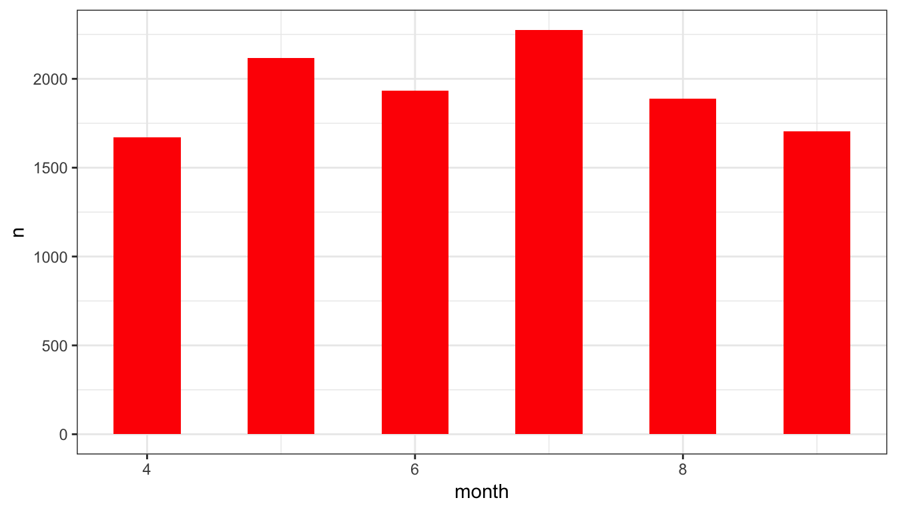

From Fig. @ref(fig:priceVsDates), it is interesting to see that the average of price is higher during summer. 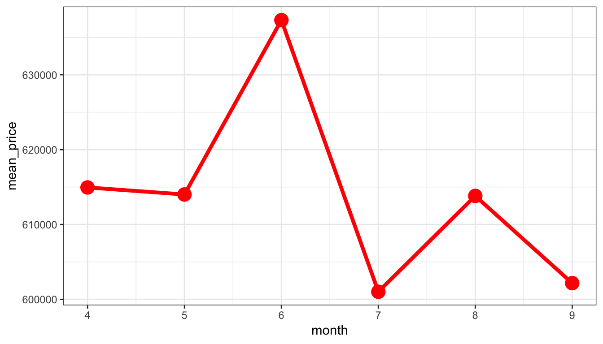

### How Does Year of Built Change with Price

From Fig. @ref(fig:yearBuiltDensity), we can see most properties were built after 1960. There are not many properties which were built before 1930. 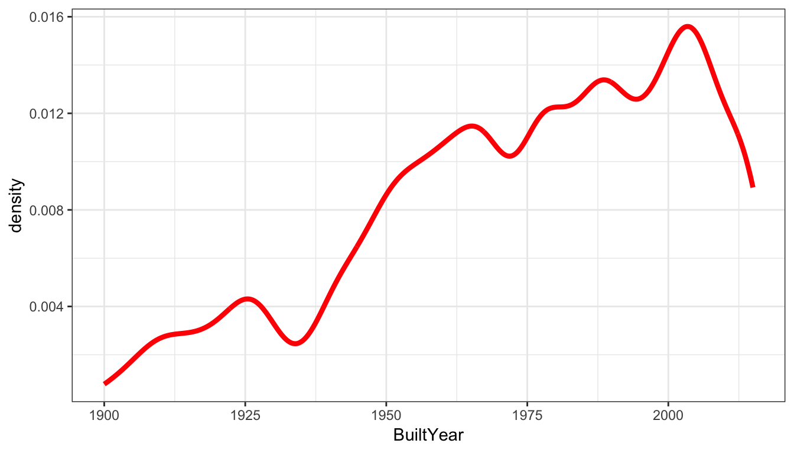 Next, we explore how price changes with year of built. From Fig.@ref(fig:yearBuiltVsPrice), we can see the variation of mean price is smaller after 1960. It is because more houses which were built after 1960 were sold. 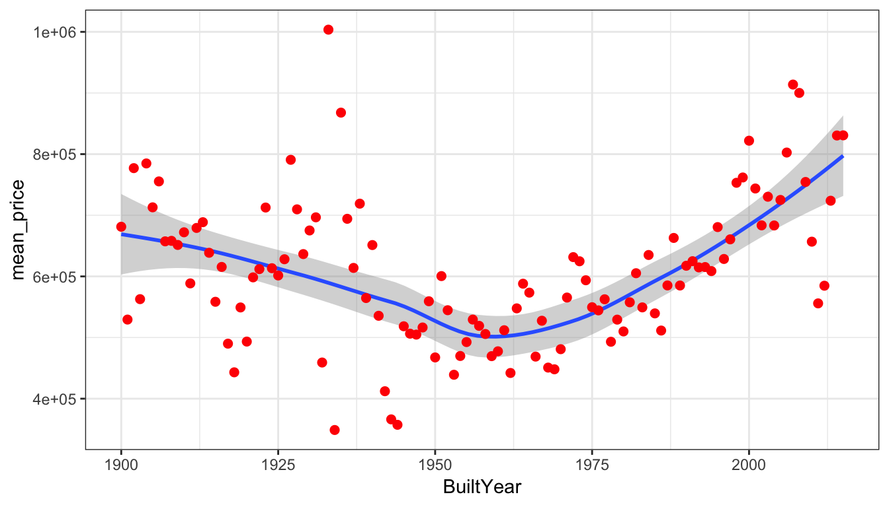

### Correlation with Price

#### Count Features

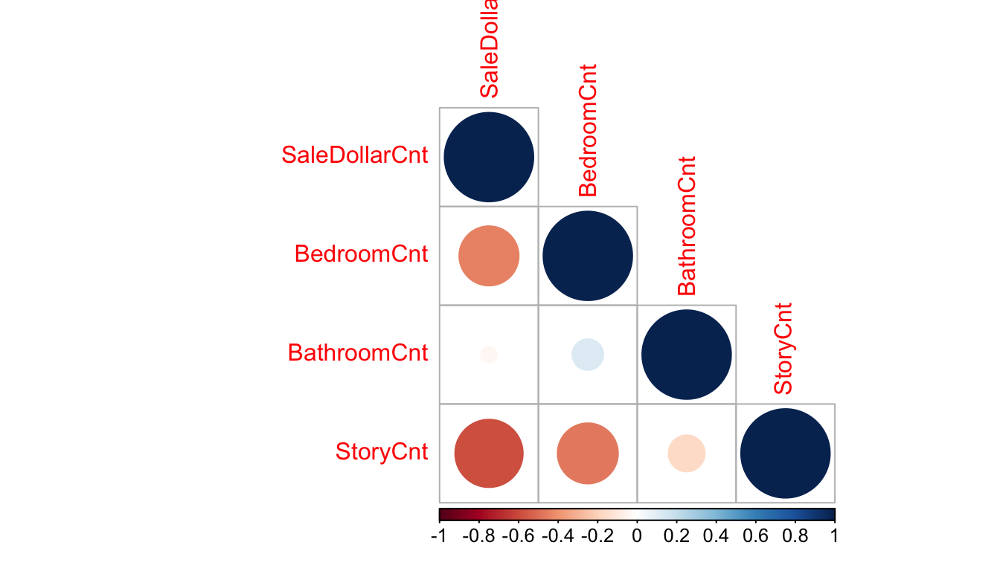 \#\#\#\# Area Features 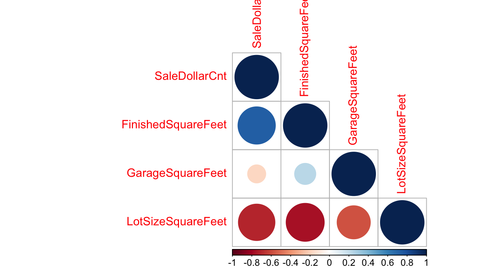

#### Block Group Features

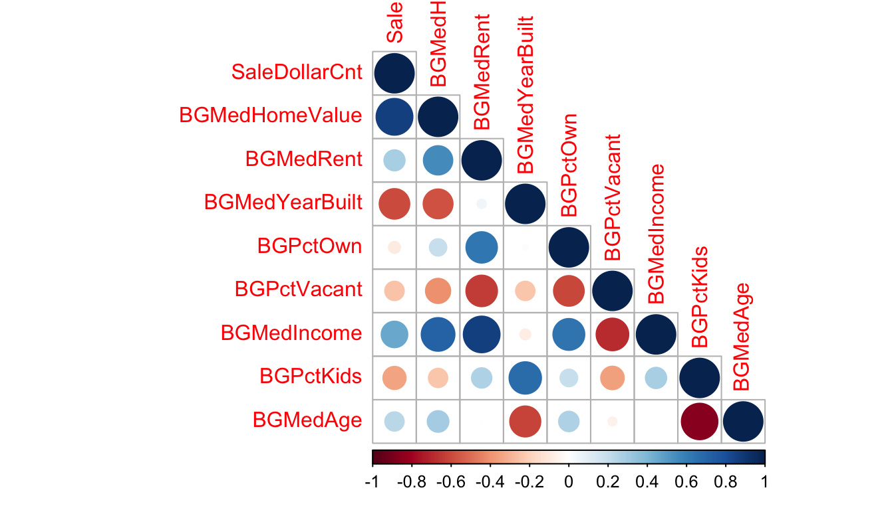

### How does the Price Change with Location

The map shows us that the price of current sale more correlates with latitude. Houses with higer latitude tend to have a higer saling price. 

### How does the Price Change with Zone

There are total 178 different zones. We notice that in most cases, there is only one property which belongs to some zones. If we treat all different zone codes as dummy variables in the model, the data is highly unbalanced. It also causes trouble and involves extremely inefficient estimation. As far as we know, real estate would like to hide the zone information, and buyers usually barely have knowledge of it. What buyers most care are the location, area, and etc.. Therefore, it is reasonable to discard the zone information in our prediction model. 

Prediction
==========

Imputation of Missing data in Testing Set
-----------------------------------------

We will use the linear model from training set to predict the missing value in the testing set. After imputation, we take the testing set to do prediction

Models
------

Our outcome is price of current sale. Potiential covariates include *ViewType, BedroomCnt, BathroomCnt, StoryCnt, FinishedSquareFeet, GarageSquareFeet , LotSizeSquareFeet, BuiltYear, month, Latitude, Longitude, BGMedHomeValue, BGMedRent, BGMedYearBuilt, BGPctOwn, BGPctVacant, BGMedIncome, BGPctKids, BGMedAge*

We start from a baseline model, linear regression.

Next, we use LASSO to do prediction. The power of the method is that it can fix overfitting problems and also help variable selection. It involves a parameter *λ*. Cross-validation will be used to select the optimal *λ*.

### Linear Model, A Baseline Reference

Seven-fold cross validation is performed. By doing this, we can check if the model's prediction accuracy isn't varying too much for any one particular sample, and if the lines of best fit don’t vary too much with respect the the slope and level.

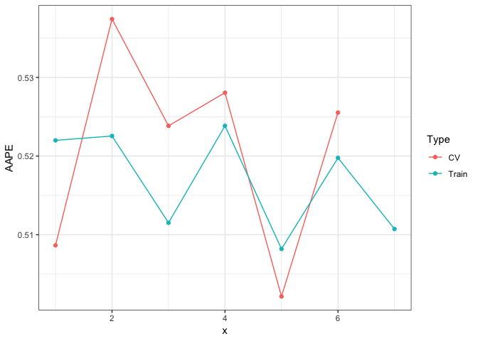

### LASSO

The loss function for LASSO is
$$ L = \\frac{1}{n}\\|Y-X\\beta\\|\_2^2 + \\lambda \\|\\beta\\|\_1.$$
 We have $\\hat \\beta$ estimated by minimize the loss function.

Fisrt, we perform a grid search to find the optimal value of *λ* by using 7-fold cross validation. The loss to use for cross-validation is squarred-error. The plot is shown in Fig. @ref(fig:lassoCV). 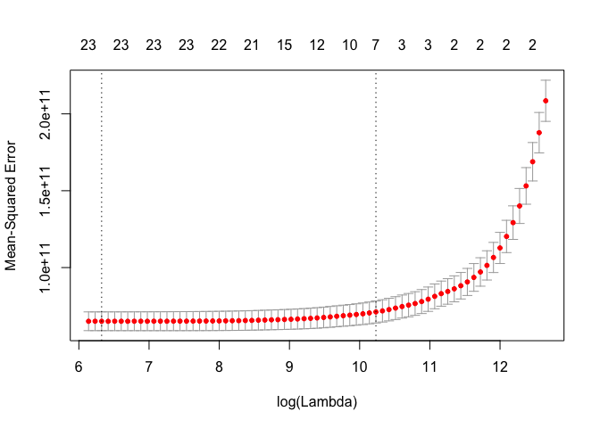

The optimal *λ* is 27771, which will be further used to predict the price of current sale in the testing set. Average Absolute Percent Error (AAPE) for training set is 0.228. Compare it with AAPE after using linear regression in Fig @ref(fig:plotLmMSE), we can see it is half smaller. LASSO does give us a better prediction. Feature selections are shown in the following.

<table class="table" style="margin-left: auto; margin-right: auto;">
<caption>
Estimation Results for LASSO
</caption>
<thead>
<tr>
<th style="text-align:left;">
variables
</th>
<th style="text-align:left;">
coef\_nonzero
</th>
</tr>
</thead>
<tbody>
<tr>
<td style="text-align:left;">
(Intercept)
</td>
<td style="text-align:left;">
3022351.09764577
</td>
</tr>
<tr>
<td style="text-align:left;">
ViewType.f78
</td>
<td style="text-align:left;">
632.86068181772
</td>
</tr>
<tr>
<td style="text-align:left;">
FinishedSquareFeet
</td>
<td style="text-align:left;">
225.41849746395
</td>
</tr>
<tr>
<td style="text-align:left;">
Latitude
</td>
<td style="text-align:left;">
0.0306938331060201
</td>
</tr>
<tr>
<td style="text-align:left;">
BGMedHomeValue
</td>
<td style="text-align:left;">
1.04155534840032
</td>
</tr>
<tr>
<td style="text-align:left;">
BGMedYearBuilt
</td>
<td style="text-align:left;">
-2409.10595092822
</td>
</tr>
<tr>
<td style="text-align:left;">
BGPctOwn
</td>
<td style="text-align:left;">
-69860.008100324
</td>
</tr>
<tr>
<td style="text-align:left;">
BGPctKids
</td>
<td style="text-align:left;">
-23323.1117051647
</td>
</tr>
</tbody>
</table>
Finally, we use our LASSO model on testing site. Prediction results are saved in **prediction\_rst.csv**. The distribution of prediction is shown in Fig. @ref(fig:TestsaleDensity) as below. We further plot the properties' price and location in the testing set. 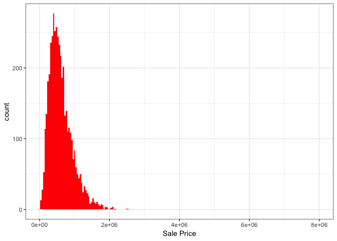


